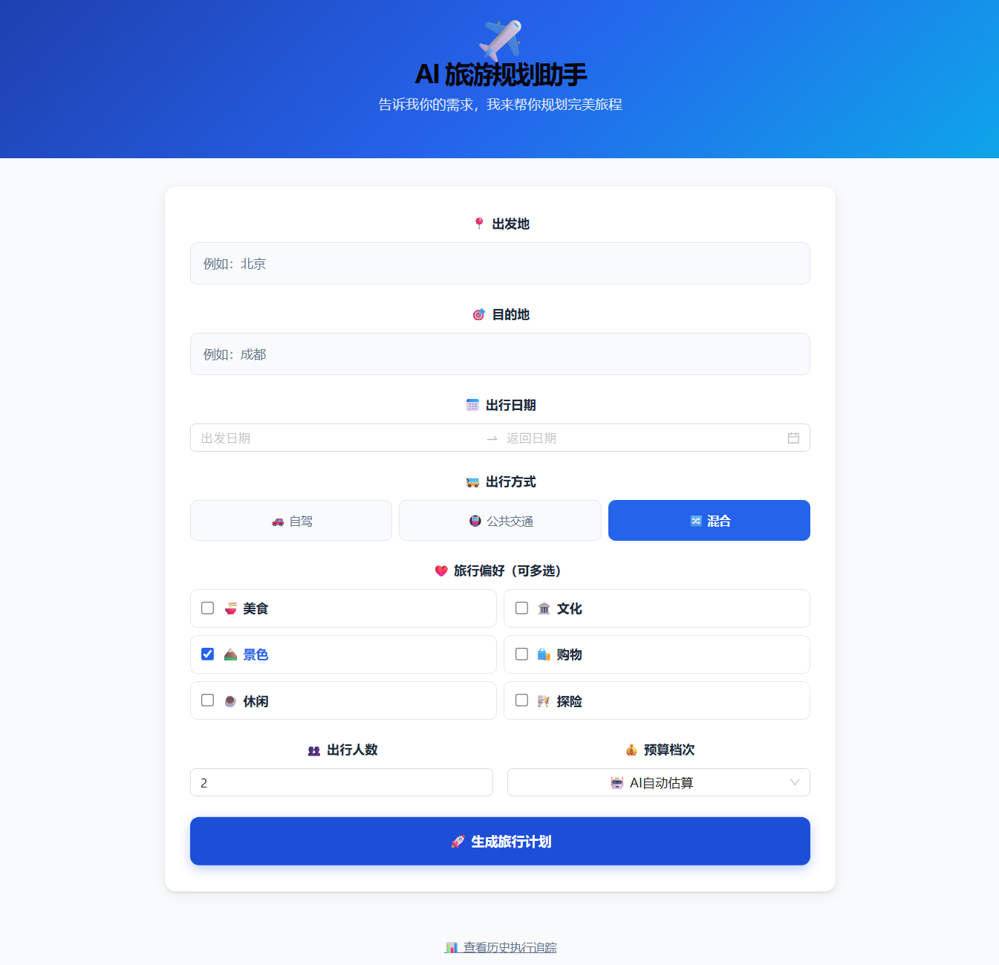
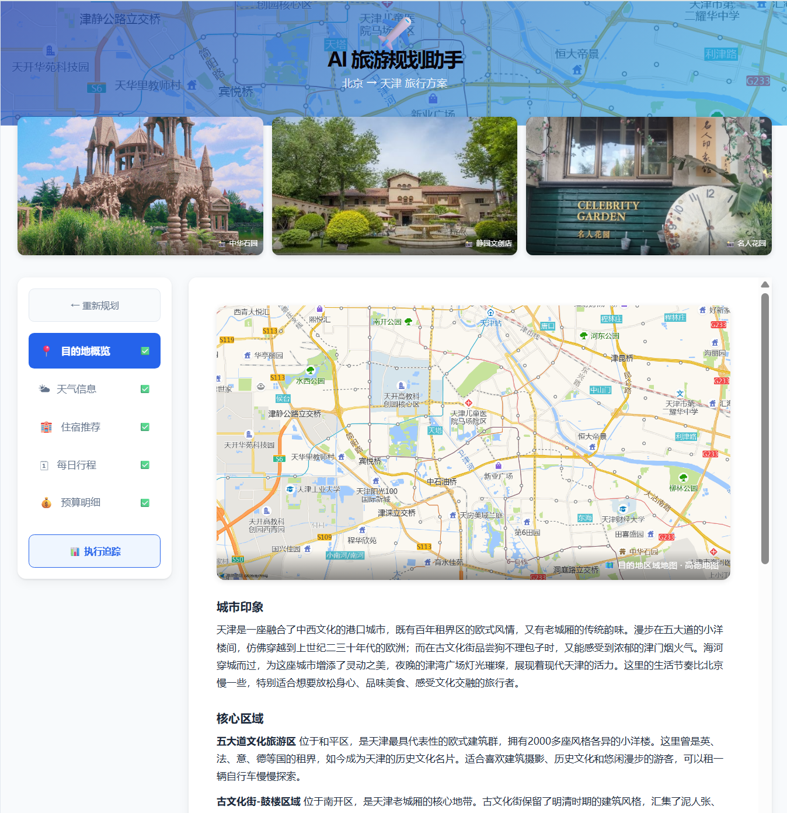
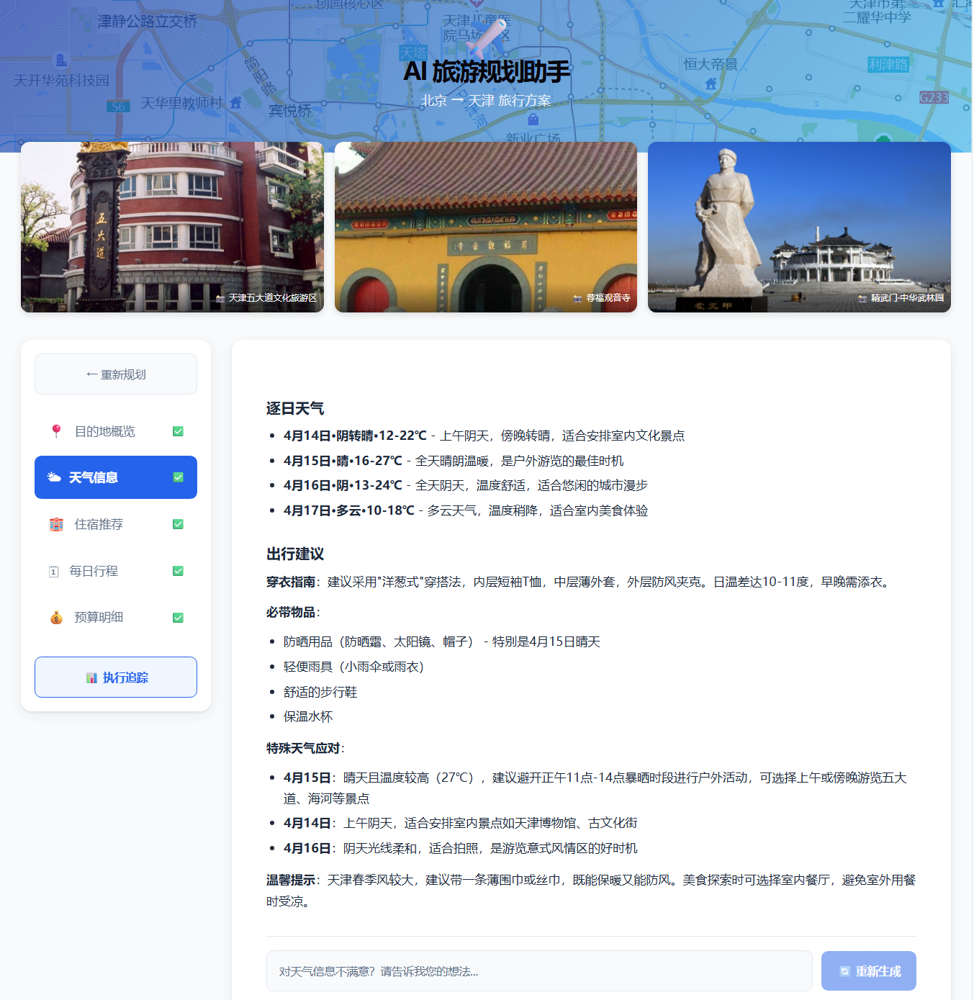
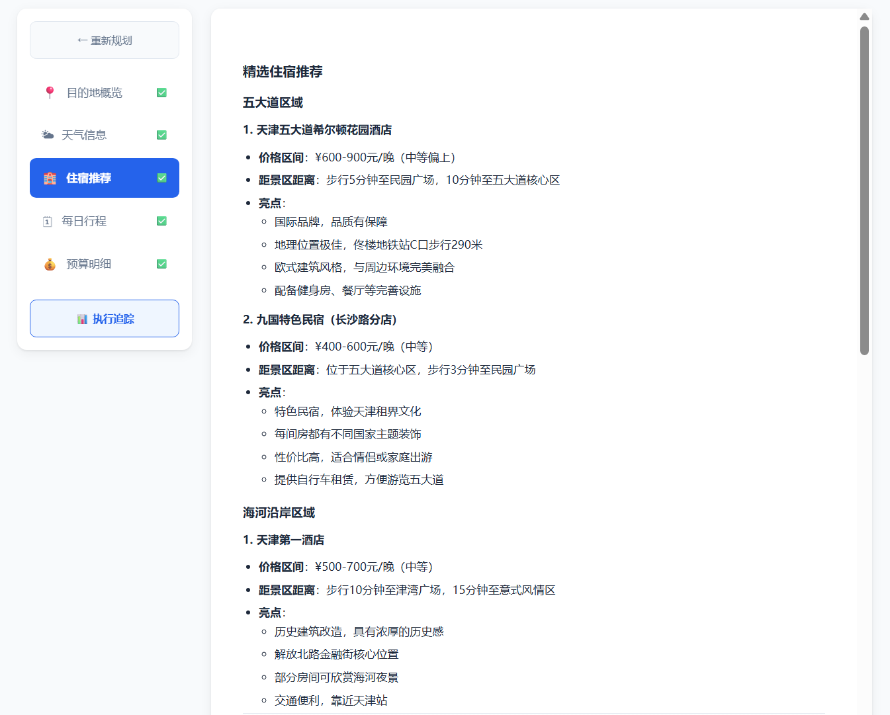
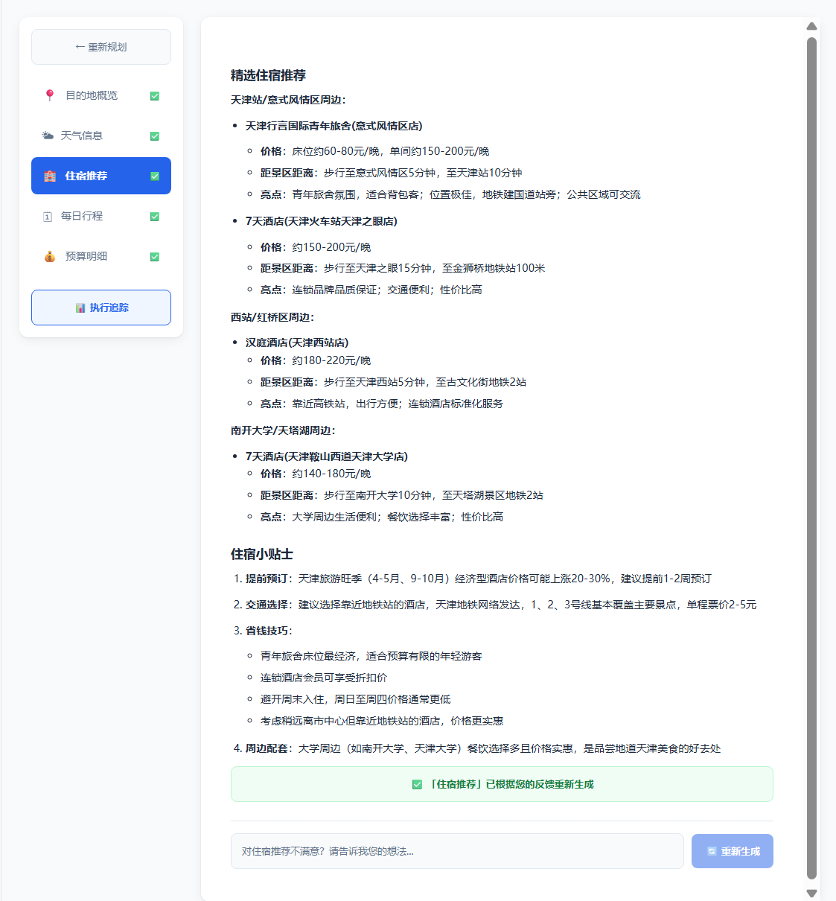
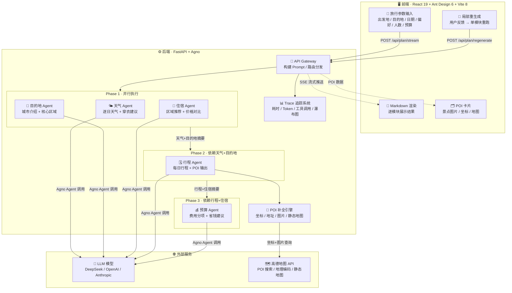

<h1 align="center">AI 旅游规划助手</h1>

<p align="center">
  基于多 Agent 协作架构的智能旅行规划系统<br/>
  输入出发地、目的地和旅行偏好，自动生成完整旅行方案
</p>

<p align="center">
  
  
  
  
</p>

<p align="center">
  
</p>

## 功能特性

- **多 Agent 协作** - 5 个专业 Agent（目的地、天气、住宿、行程、预算）分阶段并行执行，提升生成速度
- **流式输出** - 基于 SSE 逐模块推送结果，首屏快速到达
- **POI 地图集成** - 调用高德地图 API 自动补全景点坐标、地址和图片，生成每日行程地图
- **局部重生成** - 对任意模块提出修改意见，单独重跑该模块而无需全量重新生成
- **多模型支持** - 支持 DeepSeek、OpenAI、Anthropic 等模型，通过环境变量一键切换
- **Agent 追踪** - 内置 Trace 系统，记录每个 Agent 的耗时、Token 消耗和工具调用次数

## 效果展示

### 目的地概览与景点地图

<p align="center">
  
</p>

### 天气信息与出行建议

<p align="center">
  
</p>

### 住宿推荐 - 局部重生成对比

| 中高档住宿方案 | 经济型住宿方案（重生成后） |
|:---:|:---:|
|  |  |

> 左图为初次生成的中高档住宿推荐，右图为用户提出"希望更便宜"后局部重生成的经济型方案。

## 技术架构



## 技术栈

| 层级 | 技术 |
|------|------|
| 前端 | React 19 + Ant Design 6 + Vite 8 |
| 后端 | FastAPI + Agno（多 Agent 框架） |
| LLM | DeepSeek / OpenAI / Anthropic（可切换） |
| 地图 | 高德地图 Web API（POI 搜索 + 静态地图） |

## 快速开始

### 1. 克隆项目

```bash
git clone https://github.com/Aby5s/Travel_Agent.git
cd Travel_Agent
```

### 2. 配置环境变量

复制环境变量模板并填入你的 API 密钥：

```bash
cp .env.example .env  # Windows PowerShell: Copy-Item .env.example .env
```

```env
# 模型配置（三选一）
MODEL_PROVIDER=deepseek
MODEL_ID=deepseek-chat
MODEL_API_KEY=

# 高德地图
AMAP_API_KEY=
```

### 3. 启动后端

```bash
python -m venv venv
source venv/bin/activate  # Windows: venv\Scripts\activate
pip install -r requirements.txt
cd backend
uvicorn main:app --reload --port 8000
```

### 4. 启动前端

```bash
cd frontend
npm install
npm run dev
```

访问 http://localhost:5173 即可使用。

## 项目结构

```
travel_assistant/
├── backend/
│   ├── agents/              # 5 个专业 Agent
│   │   ├── destination_agent.py
│   │   ├── weather_agent.py
│   │   ├── accommodation_agent.py
│   │   ├── itinerary_agent.py
│   │   └── budget_agent.py
│   ├── tools/               # Agent 工具
│   │   └── budget_tools.py
│   ├── main.py              # FastAPI 入口 & API 路由
│   ├── schemas.py           # 请求/响应数据模型
│   ├── config.py            # 模型配置
│   └── trace_store.py       # Agent 追踪存储
├── frontend/
│   └── src/
│       ├── App.jsx          # 主界面
│       └── App.css
├── evaluation/
│   ├── run_eval.py          # 自动化测评脚本
│   └── 测评方案.md
├── .env.example             # 环境变量模板（复制为 .env 后填写）
└── requirements.txt
```

## API 接口

| 方法 | 路径 | 说明 |
|------|------|------|
| POST | `/api/plan/stream` | 流式生成旅行方案（SSE） |
| POST | `/api/plan` | 非流式生成旅行方案 |
| POST | `/api/plan/regenerate` | 局部重生成指定模块 |
| GET | `/api/images?query=城市` | 获取目的地地图和景点图片 |
| GET | `/api/traces` | 查询 Agent 追踪记录 |
| GET | `/api/traces/{id}` | 查询追踪详情 |
