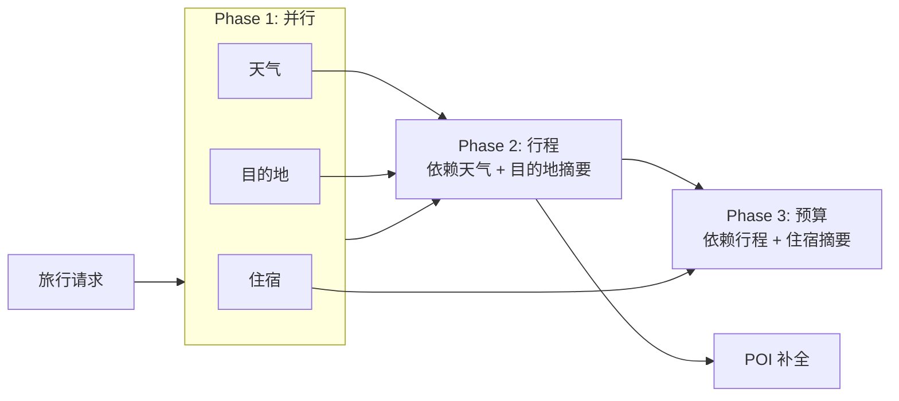
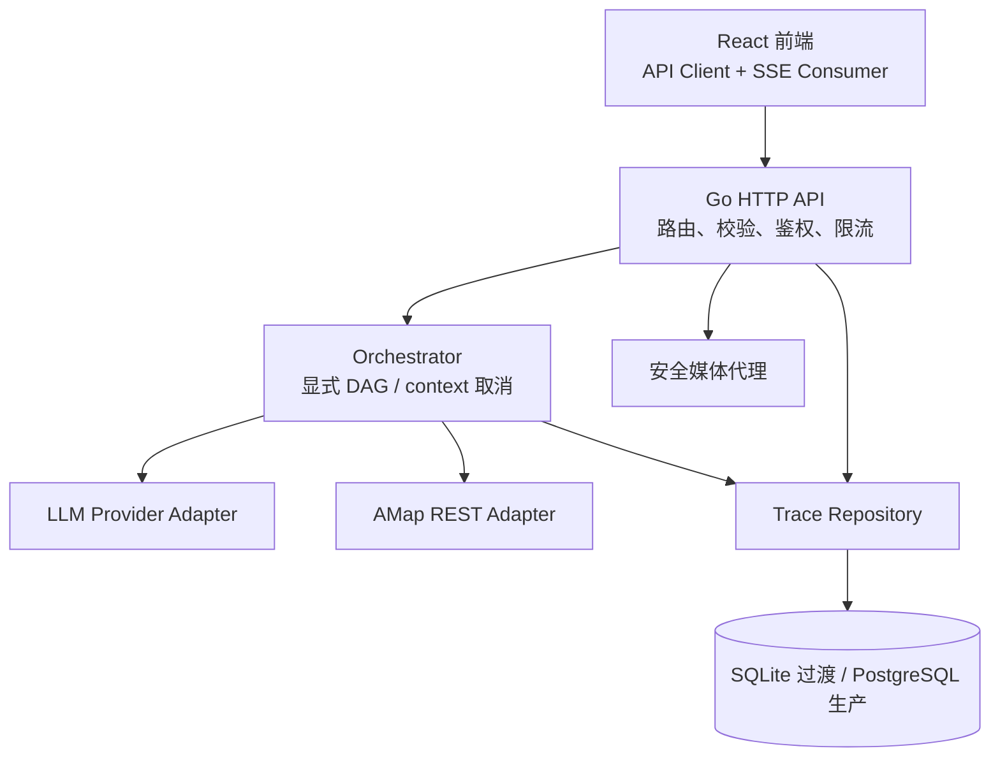

# Go 后端迁移注意事项与实施方案

> 状态：Go 后端阶段 3 已完成第一批实现。真实 LLM Provider、五模块 Prompt、三阶段编排、高德 REST、POI 补全和受控媒体代理已加入；追踪持久化和前端切换尚未完成。
>
> 目标：将 Python/FastAPI + Agno 后端渐进式迁移到 Go；在首版中维持现有 React 前端可用，并同时修复会影响安全、稳定性和部署的关键问题。

当前工作树中可复用、但尚未等同于生产实现的前置产物：

- `contracts/`：HTTP/SSE 契约说明和确定性 fixture。
- `backend-go/`：独立 Go module、`net/http` 路由、可取消 fake/real planner、输入校验、高德/POI 适配器和单元测试；追踪存储仍未迁移。

本轮已在 `backend-go/` 完成：

- 配置化 fake/real 模式；无模型凭据时默认使用 fake，避免本地启动即失败。
- OpenAI-compatible、DeepSeek 和 Anthropic HTTP Provider，凭据只从进程环境读取。
- 五个模块的 Prompt 与用户数据分隔，Phase 1 天气/目的地/住宿并行，Phase 2 行程，Phase 3 预算。
- 旧 `---POIS---` 协议解析和 `itinerary_pois` 兼容事件；LLM/编排器本地 mock 测试。
- 高德 REST 地理编码、POI 搜索、POI 坐标/地址补全和日地图计算；最大 20 个 POI 串行补全，避免无限外部调用扇出。
- `/api/images`、`/api/poi-photo`、`/api/maps/static`；高德 Key 仅保留服务端，图片和地图使用短期签名 token，图片代理限制高德 HTTPS 域名、公开 IP、重定向次数、图片类型和 5 MiB 响应上限。

Go 服务默认监听 `:8001`，Python 服务继续作为 `:8000` 的生产/回滚基线。当前已使用现有 Go 工具链验证 `go test ./...` 和 `go vet ./...`；`go test -race ./...` 因当前环境未启用 CGO 暂未执行成功。前端当前也没有安装可用的 npm 依赖，`npm run lint` 尚未执行成功。

## 1. 当前系统解读

实际运行入口是 `backend/main.py`，不是 `backend/team/travel_team.py`。后者没有被 `main.py` 引用，成员也缺少住宿 Agent，因此不能作为 Go 迁移的蓝本。

当前主流程是一个手写的三阶段依赖图：



`/api/plan/stream` 会等待 Phase 1 的三个任务全部结束，再按 `weather`、`destination`、`accommodation` 的固定顺序发出 SSE；随后是 `itinerary`、可选的 `itinerary_pois`、`budget`、`trace` 和 `[DONE]`。这意味着“后端内部并行”和“前端事件顺序”是两份不同的契约，都要保留。

当前基线来自 `evaluation/eval_results.json`：10/10 样本成功，平均总耗时 213.3 秒，平均首阶段到达 69.4 秒，平均 Token 107,927，POI 坐标命中率 100%，图片命中率 92.1%。Go 迁移后应以这些值作为回归比较基线，而非只验证接口能返回 200。

### 现有迁移产物的边界

`contracts/` 和 `backend-go/` 是有价值的迁移前置工作，但不应被误认为已经完成 Go 迁移：

- Go 骨架当前使用 fake planner，不能证明真实模型提示词、工具调用、POI 补全和预算结果与 Python 一致。
- Go 端已覆盖 `/api/images`、POI 图片和静态地图，但 `/api/traces` 与 `/api/traces/{id}` 仍由 Python 服务提供，因此它暂时不能作为前端的完整后端替换。
- 契约 fixture 固定了正常流和部分错误形状，但高德、媒体代理、追踪持久化、鉴权、限流和取消传播仍需独立测试。
- `backend/team/travel_team.py` 不是当前运行入口，且其成员和输出协议与 `backend/main.py` 不一致；迁移时应以运行入口和实际 HTTP 行为为准。

## 2. 最值得优先处理的问题

| 优先级 | 问题 | 现状依据 | 迁移要求 |
| --- | --- | --- | --- |
| P0 | 图片代理可 SSRF | `backend/main.py` 的 `/api/poi-photo` 接受任意 `url`，会跟随重定向并读取完整响应 | 只允许 HTTPS 和受控图片域名；DNS/IP 层阻断私网、回环和 metadata 地址；限制跳转次数、响应类型及大小 |
| P0 | 高德服务端 Key 暴露 | POI 缩略图、每日地图和 `/api/images` 返回的静态地图 URL 都含 `AMAP_API_KEY` | Key 只能留在服务端；地图和图片走受控代理，或改用权限受限的客户端 Key/签名机制 |
| P0 | 公共接口可滥用 LLM/地图额度 | CORS 为 `*`，计划、图片和追踪接口均无鉴权、限流或并发上限 | 生产环境启用 Origin 白名单、身份或匿名会话策略、按用户/IP 限流、请求超时和并发/费用预算 |
| P1 | Agent 失败被呈现为成功内容 | `run_agent_traced` 捕获异常后生成“模块生成失败”文本；非流式接口仍返回 `success: true` | 定义模块级失败、整体完成和部分完成语义；错误对用户脱敏，内部错误仅写日志/追踪 |
| P1 | 输入、日期和上下文缺少边界 | `schemas.py` 仅限制人数；日期在业务层解析，结束日期可早于开始日期；反馈和 `context` 无长度限制 | 用 Go DTO 统一校验日期、最大行程天数、字符串/数组/请求体大小、枚举和反馈长度；拒绝无效请求并返回 4xx |
| P1 | POI 协议脆弱 | 行程模型输出 `---POIS---` 加管道分隔文本，解析时直接 `split("|")` | 新协议改为版本化结构化 JSON + schema 校验；首版保留旧解析器作为兼容兜底 |
| P1 | 动态 `npx` MCP 运行时依赖 | 每个 Agent 都以 `npx -y @amap/amap-maps-mcp-server` 启动未锁版本的进程 | 优先使用 Go 的高德 REST 适配器；若必须保留 MCP，固定版本并以独立 sidecar 运行，不能在请求中动态下载 |
| P1 | 外部调用无全局保护 | POI 可对每个景点发多次高德请求，未限制 POI 数或并发，也缺少缓存和熔断 | 限制 POI 数、并发和全链路时限；加入连接池、重试退避、缓存、错误分类和熔断策略 |
| P1 | 追踪存储不适合多实例 | `trace_store.py` 使用相对路径 SQLite、短 UUID、每次操作新连接，无迁移/WAL/保留策略 | 单机过渡可保留 SQLite，但要用迁移、WAL、连接池、完整 UUID/ULID、索引、分页和保留策略；多实例改 PostgreSQL |
| P1 | 前端请求状态不可靠 | `frontend/src/App.jsx` 硬编码 `localhost:8000`，手写 SSE 行解析，不支持取消；SSE 错误只写控制台，旧请求可覆盖新状态 | 抽取 API Client，使用 `VITE_API_BASE_URL`，实现健壮 SSE parser、`AbortController`、请求序号和明确的错误/取消/部分完成状态 |

### 还需要一并修正的现状

- `backend/main.py` 会把上游异常原文写入 SSE 或 HTTP `detail`，可能暴露内部地址、配置或供应商信息。
- `/api/images` 的 `query`、`count`、`pool_limit` 没有范围控制；高德错误被静默转为正常的空数组，前端无法区分“无结果”和“服务失败”。
- POI 坐标解析假定值总是 `lng,lat` 且可转换为浮点数；单个异常可能影响整个计划生成。
- 流式请求没有连接断开后的取消传递，客户端离开页面后外部 LLM/地图调用可能继续消耗额度。
- 重生成流程没有持久化 trace，且前端收到 SSE 内错误后仍可能显示“已重新生成”。
- `trace` 列表暴露历史出发地和目的地，未来需要用户隔离、分页、访问控制与保留期限。
- 用户输入、偏好和重生成反馈直接拼进 LLM prompt，缺少长度边界和清晰的用户内容分隔；迁移时要避免通过超长输入、提示注入或上下文膨胀放大模型费用和行为不确定性。
- 当前机器的 `go` 命令不在 PATH，`npm run lint` 也因前端依赖未安装而未能执行；实施前需固定 Go/Node/npm 版本并补齐可重复的安装、测试和 CI 流程。仓库当前已有 `backend-go/go.mod`、Go 测试和契约目录，但尚无完整 Go 生产服务、Dockerfile 或 CI。

## 3. 首版必须保持的兼容契约

首版不要同时改语言、接口和前端数据模型。Go 服务应先作为 Python 服务的可替换实现，保持以下对外行为：

| 范围 | 兼容要求 |
| --- | --- |
| 请求字段 | 维持 snake_case：`origin`、`destination`、`start_date`、`end_date`、`transport`、`preferences`、`people`、`budget_level`；继续接受当前中文枚举值 |
| 普通生成 | `POST /api/plan` 保持五个 Markdown 字段和 `itinerary_pois` 的兼容形状 |
| 流式生成 | `POST /api/plan/stream` 继续输出 UTF-8 的 `data: <JSON>\n\n`；stage 顺序固定为 `weather`、`destination`、`accommodation`、`itinerary`、可选 `itinerary_pois`、`budget`、`trace`、`[DONE]` |
| 局部重生成 | `POST /api/plan/regenerate` 保留五个模块名；行程重生成仍可发送 `itinerary_pois` |
| 图片和追踪 | 保留 `/api/images`、`/api/traces`、`/api/traces/{id}`、`/health` 的能力；图片/地图 URL 的内部实现可以安全替换 |
| 回滚 | Python 服务保留至 Go 完成契约、回归和灰度验收；通过反向代理或环境变量切回 Python |

兼容不等于复制现有缺陷。Go 服务可以增加标准 SSE 事件名、心跳、请求 ID、明确错误码和更多响应字段，但旧前端必须继续能解析原有 `data:` 内容；前端完成升级后再逐步启用新字段。

## 4. 推荐目标架构



建议在 `backend-go/` 建立独立 Go module，首版可采用 `net/http` + `chi`，避免引入不必要的 Web 框架耦合。应用层按接口隔离：

```text
backend-go/
  cmd/server/                 # 组装配置与 HTTP 服务
  internal/api/               # handler、DTO、SSE writer、中间件
  internal/planner/           # 三阶段 DAG、摘要、重生成逻辑
  internal/agent/             # 五个领域提示词和 LLM 调用接口
  internal/provider/llm/      # OpenAI-compatible / Anthropic 实现与 fake
  internal/provider/amap/     # 高德 REST、POI、地图、图片策略
  internal/trace/             # repository、迁移、模型
  internal/media/             # 域名白名单和安全代理
  migrations/                 # SQLite/PostgreSQL 可追踪迁移
```

编排层用 `context.Context` 贯穿 HTTP、LLM、地图和数据库调用；Phase 1 使用 `errgroup` 并行执行，Phase 2/3 显式接收已经裁剪或结构化的上游结果。每个阶段均有独立超时、并发限制和可观测 span，浏览器断开连接时取消下游调用。

## 5. 前端需要配合的调整

前端不需要因后端改成 Go 而重写界面，但需要把目前写在 `App.jsx` 内的通信细节抽出来：

1. 新建 API Client，统一通过 `VITE_API_BASE_URL` 或同源 `/api` 请求，去掉全部 `http://localhost:8000`。
2. 新建 SSE 消费器，正确处理网络分片、UTF-8、CRLF、多行 `data:`、心跳、`[DONE]` 和服务器错误事件。
3. 为生成和重生成分别保存 `AbortController` 与请求序号；用户返回、发起新计划或取消时终止旧请求，旧响应不得写入新页面状态。
4. 将页面状态从单个 `loading` 布尔值改为 `idle`、`streaming`、`partial`、`succeeded`、`failed`、`cancelled`；按模块记录 `ready/error`，避免失败后显示“生成完成”。
5. 所有 `fetch` 都检查非 2xx 响应并展示脱敏、可操作的错误；图片加载失败保留当前占位降级。
6. `itinerary_pois` 使用明确的 TypeScript/JSDoc 数据结构；兼容旧字段，同时准备接受新协议的 `version` 与结构化 POI。
7. 保留当前每日 POI 卡片视图，并补上服务端返回的 `maps` 日地图展示或明确不再返回该字段，避免无效接口负担。
8. 追踪页按新的访问控制处理 401/403/404，避免把任意历史 trace 视为公开资源。

建议把前端改造放在 Go 服务契约测试稳定后实施，但 API 基址、取消与错误状态可以先独立提交，不依赖 Go 完成。

## 6. 分阶段实施方案

### 阶段 0：冻结契约与基线

- 从现有 Python 服务录制正常、部分失败、上游超时、非法输入、取消请求的 HTTP/SSE fixture。
- 为五个接口建立契约测试，明确字段、SSE 顺序、终止符、错误格式和 UTF-8 分片行为。
- 保存当前 10 个评测样本和指标，补充 mock LLM/高德测试数据。
- 安装 Go 并确定版本、模块代理、配置加载和本地启动方式。

**完成门槛：** 测试能证明 Python 当前的正常对外契约，且能暴露当前已知缺陷，不把缺陷误当作目标行为。

### 阶段 1：Go 服务骨架与安全边界

- 建立 `backend-go/`、`go.mod`、配置结构、健康检查、结构化日志、request ID、错误模型和 CI 基础。
- 实现严格 DTO：日期顺序、最大旅行天数、字符串/反馈/上下文长度、枚举、请求体大小。
- 配置 CORS allowlist、限流、超时、并发闸门；认证策略至少预留中间件与 trace 所有者字段。
- 实现兼容路由和 SSE writer，但先接 fake planner 以便快速测通。

**完成门槛：** `go test ./...`、`go vet ./...` 通过；所有无效请求返回稳定 4xx；前端可只改 API 基址访问 fake Go 服务。

### 阶段 2：LLM 与三阶段编排（当前已完成第一批）

- 抽象 LLM Provider 接口，首批实现项目实际使用的模型供应商；所有外部调用支持超时、取消、重试和脱敏错误。
- 将五个 Agent 的提示词迁移为可测试的领域模块，不直接复制 Agno Team。
- 实现 Phase 1 并行、Phase 2 行程、Phase 3 预算的显式 DAG，并维持当前摘要限制和 SSE 事件顺序。
- 定义部分失败策略：可展示的模块结果与模块错误分开；整体 status 不再因为错误文本而误判成功。

**当前结果：** Provider、Prompt、编排、流式/重生成和取消路径已具备本地 mock 测试；真实模型小样本尚未执行。阶段整体仍需等待高德数据、追踪数据和真实模型回归。

### 阶段 3：高德、POI 与媒体安全替换（第一批已完成）

- 用强类型高德 REST Client 取代请求期间的 `npx` MCP；增加缓存、限额、重试退避、熔断和可观测指标。
- 让行程模型优先返回结构化 JSON：Markdown、每日 POI、价格/时长等字段分离，并作 schema 校验；旧 `---POIS---` parser 作为短期降级。
- 限制 POI 总数/并发，逐 POI 降级，不能因单个坐标或图片失败导致整单失败。
- 实施安全图片/地图代理，彻底移除服务端 Key 直出。

**完成门槛：** SSRF、私网重定向、大图片、非图片类型和 Key 泄露均有自动化回归；POI 结构化协议与旧前端兼容。

**当前结果：** 高德 REST Client、POI 补全、地图/图片受控代理以及 Key/token/非图片防护的本地 mock 回归已完成。媒体 token 为进程内短期状态，因此服务重启后旧媒体 URL 会失效；生产多实例部署前需要共享 token 存储或把媒体代理固定为同一实例。

### 阶段 4：追踪存储与前端适配

- 迁移 trace 数据模型：完整 ID、状态、错误码、开始/完成时间、上游耗时、请求归属、分页和保留策略。
- 单机先使用 SQLite 时启用迁移、WAL、busy timeout、索引和绝对数据目录；部署目标若是多实例，直接使用 PostgreSQL。
- 前端接入 API Client、健壮 SSE、取消、错误状态、过期响应隔离和新版 POI 类型；补上日地图或删除无用字段。

**完成门槛：** 浏览器切换、取消、重生成失败、trace 权限失败均有可理解界面状态；无硬编码 localhost。

### 阶段 5：双跑、灰度与切换

- 用 feature flag/反向代理在 Python 与 Go 之间切换；同一输入可在隔离环境双跑对比模块、POI 和性能。
- 先将少量开发流量导向 Go，观察错误率、取消率、上游调用、Token、时延和 POI 命中。
- 达到验收门槛后切换默认服务；Python 仅在回滚窗口结束后归档或移除。

**完成门槛：** 有明确回滚开关、数据库备份和运行手册；不存在“只能前进、无法恢复”的发布步骤。

## 7. 验收标准

### 功能与兼容

- 五个计划模块、POI、图片、追踪和五种局部重生成均可用。
- `/api/plan`、`/api/plan/stream`、`/api/plan/regenerate` 的既有请求可继续工作；SSE 分片中的中文不会丢失或乱码。
- Go 端正常流的 stage 顺序与现有前端约定一致；服务端错误、部分成功、取消和真正完成可被前端区分。

### 安全与稳定性

- 日期、人数、枚举、字段长度、请求体、最大天数和反馈均有服务端校验。
- 高德/LLM Key 不进入 HTTP 响应、前端 bundle、trace 或普通日志。
- 图片代理通过 SSRF 和响应大小/类型测试；CORS、鉴权、限流和 trace 访问控制均生效。
- 客户端断开后，后续 LLM/高德请求被取消；外部依赖异常不泄露内部细节。

### 质量与性能

- `go test ./...`、`go vet ./...`、必要的 `go test -race ./...` 以及前端 `npm run lint`、`npm run build` 全部通过。
- 现有 10 个评测样本成功率为 10/10；平均总时延、首屏时延、Token 和 POI 命中率相对基线不劣化超过 10%，或经过审核记录原因。
- 新增 HTTP/SSE 契约、输入校验、SSRF、密钥泄露、取消、部分失败、trace 完整性和高德/LLM mock 测试。

## 8. 需要审核确认的决策

以下四项会直接影响第一版的实现范围，建议确认后再写 Go 业务代码：

| 决策 | 推荐默认值 | 原因 |
| --- | --- | --- |
| API 迁移策略 | 首版完全保留现有 `/api/*` 路径、字段与 SSE stage | 可以让前端无感切换，并保留快速回滚能力 |
| 地图适配终态 | 高德 REST Client，不保留请求期 `npx` MCP | 更可控、可测试，消除 Node/npm 动态下载与子进程风险 |
| POI 协议切换 | Go 首版同时支持旧文本 parser；新接口在同一次响应中加入版本化结构化 JSON | 先稳住前端，再逐步删除自由文本协议 |
| 持久化 | 本地/单机先 SQLite 过渡；计划多实例部署则直接 PostgreSQL | 避免为演示环境过度设计，也避免未来横向扩容时返工 |

## 9. 本次不实施的内容

- 不在本轮删除 Python 后端、历史 trace 数据或前端现有功能。
- 不在未确认认证、部署拓扑和数据库选择前擅自引入用户体系或云服务。
- 不把“换成 Go”当作仅语法翻译：安全边界、外部服务稳定性、契约测试和回滚能力是迁移的组成部分。
